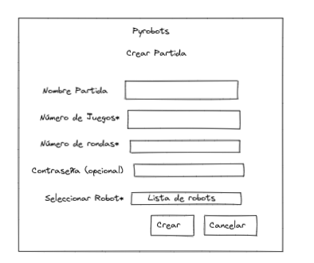

# Ticket: Formulario Crear Partida

Formulario de crear partida tiene nombre, cantidad de juegos (1 a 200), 
cantidad de rondas (1 a 10.000), jugadores (2 a 4), contraseña opcional y robot 
del creador. Si queda un campo sin completar o el número de juegos, jugadores o 
rondas está fuera de rango se le muestra un mensaje al usuario.

## Primer paso:

Realizar el esqueleto del formulario donde muestre los campos que va a tener como la siguiente figura:

## Segundo Paso:

Poner restricciones a los campos, decidimos usar los estilos de https://getbootstrap.com/docs/4.0/components/forms/
## Tercer paso:

Darle un mejor estilo

## Linkear con la Api:
